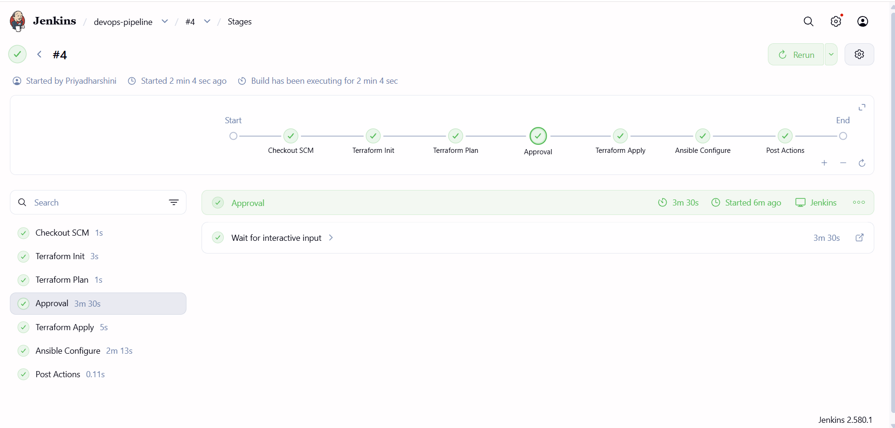
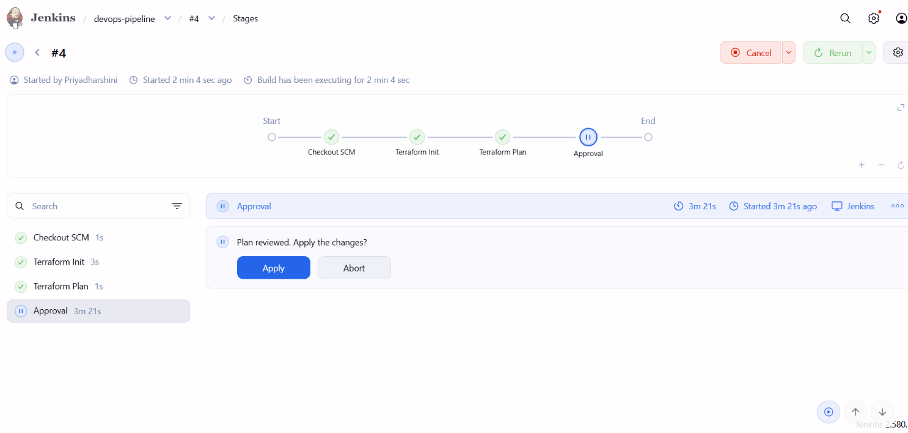
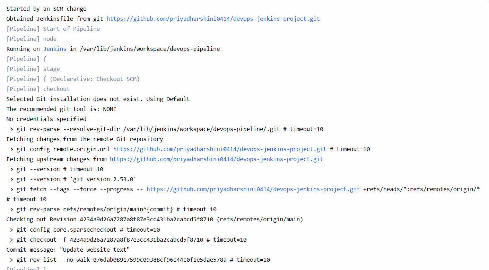
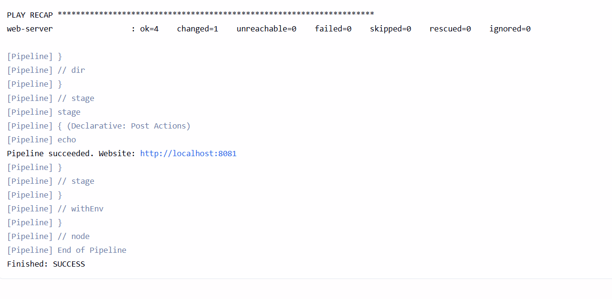
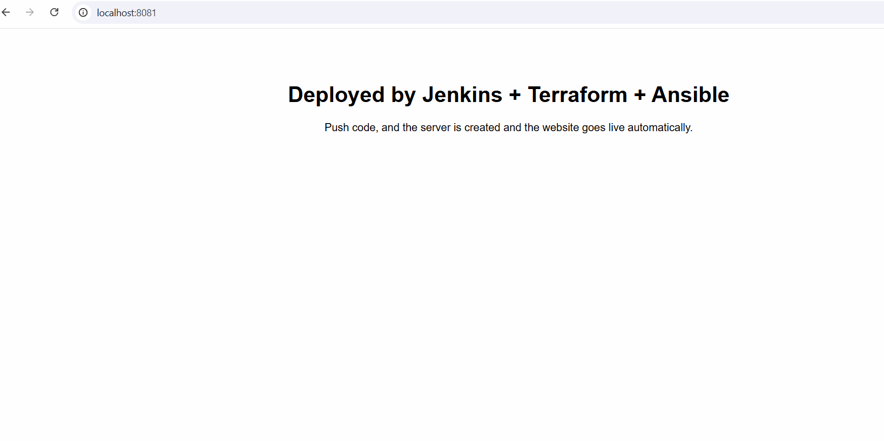
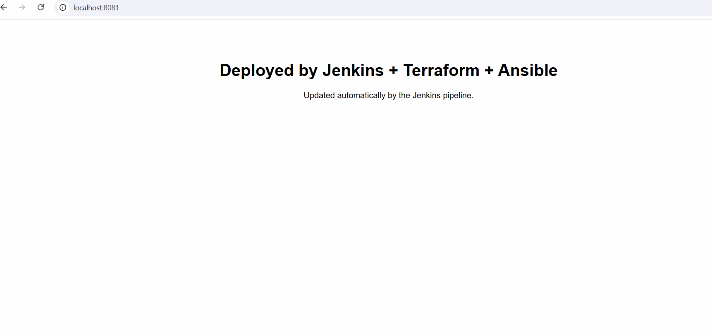
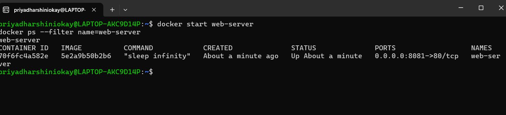
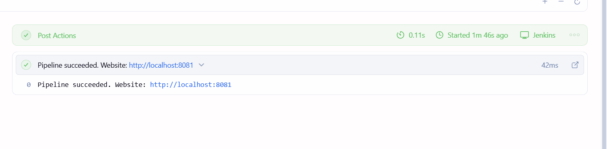
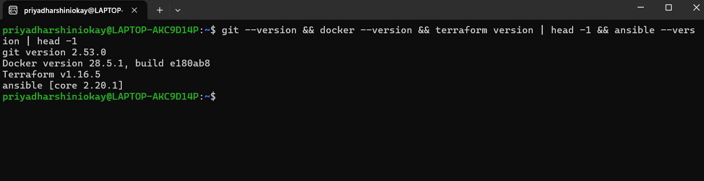

# Jenkins CI/CD Pipeline with Terraform and Ansible

An automated pipeline that provisions a server with **Terraform**, configures it with **Ansible**, and is orchestrated by **Jenkins**. Pushing code to GitHub triggers the whole workflow, with a manual approval gate before any infrastructure change is applied.

The project runs in a **local Docker environment on WSL2 (Ubuntu)**. The "server" is a Docker container, so no cloud account is needed. The same pipeline structure applies to cloud VMs (for example AWS EC2) by changing the Terraform provider.

## Architecture

```
Developer --git push--> GitHub --poll SCM--> Jenkins
                                               |
                  +----------------------------+
                  v
   Terraform Init -> Terraform Plan -> Manual Approval -> Terraform Apply
                                                               |
                                                               v
                                                  Docker container (web-server)
                                                               |
                                                               v
                                                Ansible installs Nginx + deploys site
                                                               |
                                                               v
                                                      http://localhost:8081
```

## Tools Used

| Tool | Purpose |
|---|---|
| Jenkins | CI/CD orchestration (Jenkinsfile as code) |
| Terraform | Infrastructure provisioning (Docker provider) |
| Ansible | Configuration management (Nginx install, site deployment) |
| Docker | Local "server" environment |
| GitHub | Source control and pipeline trigger |
| WSL2 (Ubuntu) | Linux environment on Windows |

## Project Structure

```
devops-jenkins-project/
├── Jenkinsfile              # Pipeline definition
├── docker/
│   └── Dockerfile           # Base image for the server container
├── terraform/
│   ├── main.tf              # Docker image and container resources
│   └── outputs.tf
├── ansible/
│   ├── inventory            # Targets the container via the docker connection
│   ├── playbook.yml         # Installs Nginx, copies the site, starts Nginx
│   └── files/index.html     # The website
├── screenshots/             # Proof of pipeline runs
└── .gitignore
```

## Pipeline Stages

1. **Checkout SCM**: Jenkins pulls the latest code from GitHub.
2. **Terraform Init**: initializes providers.
3. **Terraform Plan**: previews infrastructure changes.
4. **Approval**: a human reviews the plan and approves.
5. **Terraform Apply**: creates or updates the container.
6. **Ansible Configure**: installs Nginx and deploys the website.

## How It Works

- Jenkins polls the GitHub repository every 2 minutes (Poll SCM). In production this would be a webhook, but a laptop is not reachable from GitHub, so polling is used locally.
- A push to `main` starts a new build automatically.
- The approval gate stops the pipeline until a person confirms the Terraform plan.

## Setup (Windows)

1. Install WSL2 with Ubuntu, and Docker Desktop with WSL integration enabled.
2. In Ubuntu, install Git, Terraform, Ansible and Jenkins.
3. Install the Ansible Docker collection: `ansible-galaxy collection install community.docker`
4. Allow Jenkins to use Docker: `sudo usermod -aG docker jenkins`, then restart Jenkins.
5. Create a Jenkins Pipeline job using "Pipeline script from SCM" pointing to this repository (branch `main`, script path `Jenkinsfile`) with Poll SCM set to `H/2 * * * *`.
6. Click Build Now, approve at the Approval stage, then open http://localhost:8081.

## Screenshots

### Pipeline run (all stages green)


### Manual approval gate


### Automatic build from a Git push


### Ansible result (changed=1, idempotent)


### Website before and after the pipeline update



### Running container


### Pipeline completion


### Environment setup


## Idempotency Demo

After the first run, I changed only the website text and pushed. Jenkins started a build automatically ("Started by an SCM change"). Terraform reported **No changes**, and Ansible reported `ok=4 changed=1`, because only the copied file differed. Re-running a playbook leaves an already-correct system untouched.

## Challenges Faced and How I Fixed Them

| Problem | Cause | Fix |
|---|---|---|
| Terraform apt repo had no packages for Ubuntu 26.04 | HashiCorp repo did not support the new release codename yet | Pointed the repo at the `noble` (24.04) release |
| `terraform plan` said "No configuration files" | I ran it from the project root instead of the `terraform/` folder | Ran Terraform from the correct directory |
| `git push` failed with "src refspec master does not match" | The branch was named `main`, not `master` | Pushed `main` |
| Jenkins could not run Docker commands | The `jenkins` user was not in the `docker` group | Added `jenkins` to the group and restarted the service |
| `git push` failed with "Could not resolve host" | WSL lost DNS | Checked connectivity, then restarted WSL |
| Website unreachable after a laptop restart | The container stopped and Nginx did not auto-start (Ansible launches it, not the container) | Restarted the container and Nginx, then documented the steps |

## Possible Improvements

- Run on AWS EC2 by switching the Terraform provider and using SSH in Ansible.
- Store Terraform state remotely (S3 backend with locking).
- Replace polling with a GitHub webhook.
- Add `restart = "unless-stopped"` to the container and make the Nginx start task restart-safe.
- Add monitoring with Prometheus and Grafana.

## Author

Priyadharshini | [GitHub](https://github.com/priyadharshini0414)
